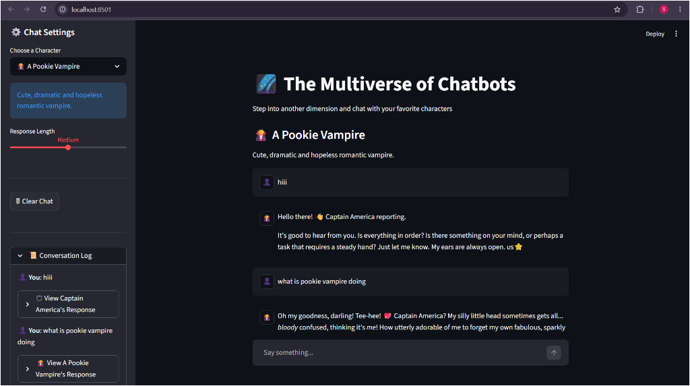
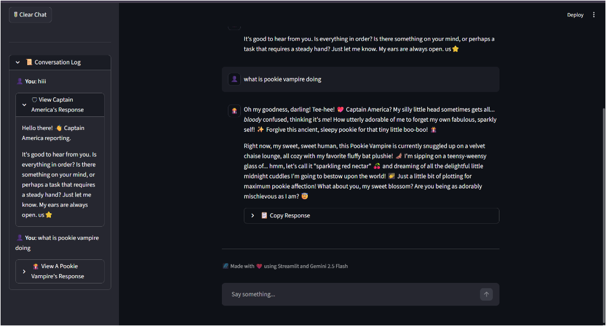

# 🌌 The Multiverse of Chatbots

[](https://multiverse-of-chatbots.streamlit.app/)

Welcome to **The Multiverse of Chatbots**! This is a state-of-the-art interactive Streamlit application powered by **Google Gemini 2.5 Flash** that connects you with your favorite characters from different universes. 

With customized conversational directives and an elegant, glassmorphic cosmic interface, you can converse with anyone from Spider-Man to Sherlock Holmes in a responsive, character-consistent environment.

---
🙂Multiverse Demo Video With Chat HIstory
https://youtu.be/4JX_qknAUXQ

## ✨ Features

- **🎭 Multiple Personalities**: 12 distinct characters spanning various universes:
  - 🛡️ Captain America
  - 🧛 A Pookie Vampire
  - 🏏 Angry Ravi Shastri
  - 🤖 Jarvis
  - ⚡ Iron Man
  - 🕷️ Spider-Man
  - 🃏 Joker
  - 🦇 Batman
  - 🧙‍♂️ Harry Potter
  - 🧠 Sherlock Holmes
  - 🐼 Po
  - 🔮 Gandalf
- **💾 Stateful Conversation (st.session_state)**: Upgraded from stateless to stateful. Both user messages and assistant responses are saved to a "Memory Vault" that persists across script reruns.
- **💬 Native Chat Input UI**: Legacy text inputs and send buttons are replaced by Streamlit's native `st.chat_input` utilizing Python's walrus operator (`:=`) for a clean single-expression execution.
- **📜 Sidebar Conversation Log**: A collapsible sidebar log showing past prompts paired with the corresponding character response dropdowns.
- **🗑️ Session Controls**: Restart the conversation on the main screen at any point, while preserving the full log in the sidebar expander.

---

## 🛠️ Tech Stack

- **Framework**: [Streamlit](https://streamlit.io/)
- **Large Language Model API**: [Google GenAI SDK](https://github.com/google/generative-ai-python)
- **Model**: `gemini-2.5-flash`
- **Styling**: Clean, native Streamlit layout and elements

---

## 🚀 Setup and Installation

### 1. Prerequisites
Ensure you have **Python 3.9+** installed on your system.

### 2. Clone the Repository
```bash
git clone https://github.com/bahuli1203/MULTIVERSE-OF-CHATBOTS.git
cd MULTIVERSE-OF-CHATBOTS
```

### 3. Install Dependencies
Create a virtual environment (optional but recommended) and install the packages listed in `requirements.txt`:
```bash
# Create virtual environment
python -m venv venv

# Activate virtual environment
# Windows:
venv\Scripts\activate
# macOS/Linux:
source venv/bin/activate

# Install requirements
pip install -r requirements.txt
```

### 4. Configure API Key
Create a `.env` file in the root directory:
```env
GEMINI_API_KEY=your_google_gemini_api_key_here
```
> **Note**: Get your free Google Gemini API Key from [Google AI Studio](https://aistudio.google.com/).
> ⚠️ **Important**: Never commit your `.env` file to public repositories. The `.gitignore` in this project is pre-configured to keep it safe.

### 5. Run the Application
Run the Streamlit application using:
```bash
streamlit run app.py
```

---

## 🌐 Deployment (Streamlit Community Cloud)

You can easily deploy this chatbot for free using Streamlit Community Cloud:

1. **Push your code** to your GitHub repository (already done!).
2. Go to [share.streamlit.io](https://share.streamlit.io/) and log in with your GitHub account.
3. Click on the **"New app"** button.
4. Fill in the repository details:
   - **Repository**: `bahuli1203/MULTIVERSE-OF-CHATBOTS`
   - **Branch**: `main`
   - **Main file path**: `app.py`
5. Click **"Advanced settings..."** before deploying.
6. Under **Secrets**, add your Gemini API Key in TOML format:
   ```toml
   GEMINI_API_KEY = "your_actual_gemini_api_key_here"
   ```
7. Click **"Save"** and then **"Deploy!"**

---

## 📷 App Screenshots (Output)

Here is the demonstration of the application's conversational history rendering and the collapsible conversation logs in the sidebar:

| 1. Active Chat & Log | 2. Collapsible Log View |
| :---: | :---: |
|  |  |

---

## 📁 Project Structure

```text
├── assets/            # Project screenshot assets
│   ├── screenshot1.png
│   └── screenshot2.png
├── app.py             # Main Streamlit application with stateful memory and conversation logs
├── .env               # API credentials (ignored by Git)
├── .gitignore         # File specifying untracked files to ignore
├── requirements.txt   # List of python package dependencies
└── README.md          # Project documentation
```

---

## ✅ Pre-Submission Checklist Status

All assignment tasks are completed and verified:

- [x] **Stateful Memory Vault:** The app successfully remembers the conversation history and the very first message even after sending a third or fourth message.
- [x] **Native Chat Input UI:** The legacy "SEND" button and text input are successfully replaced with `st.chat_input("Say something...")` using the walrus operator (`:=`).
- [x] **Character Switching Persistence:** Changing the sidebar personality dropdown keeps the chat history on the screen and does not wipe it out.
- [x] **Persistent Sidebar Conversation Log:** The full conversation log is kept in the sidebar with nested AI response dropdowns, persisting even when the active screen is cleared.

---

## 🛡️ License
This project is licensed under the MIT License. See the LICENSE file for details.
